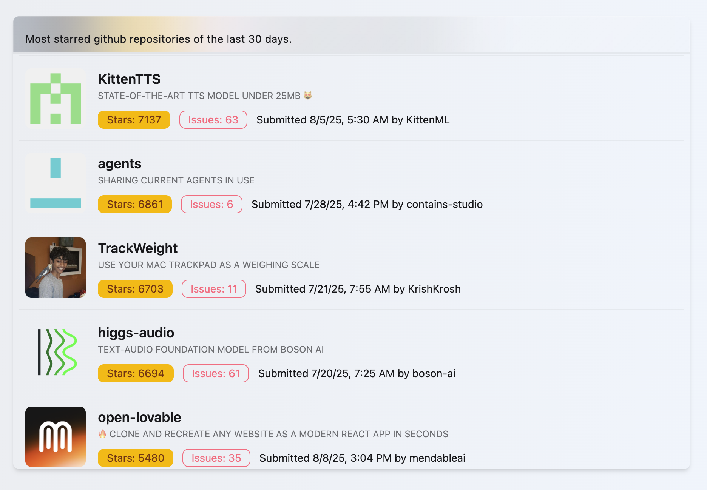

# 🌟 GitHub Most Starred List

**A Modern Angular 19 Web App – Showcasing GitHub's Top Repositories from the Last 30 Days.**


---

## 🎯 What is this?

> **Frontend Coding Challenge Solution**  
> A responsive web application that displays the most starred GitHub repositories created in the last 30 days.

Built with **Angular 19**, **Tailwind CSS**, and **DaisyUI** – this project demonstrates modern frontend development practices, clean architecture, and comprehensive testing strategies.

---

## 📸 App Screenshot



---

## 🥪 Tech Stack

| Area           | Technology                             |
| -------------- | -------------------------------------- |
| **Framework**  | Angular 19 (Standalone Components)     |
| **Styling**    | Tailwind CSS 3 + DaisyUI               |
| **Testing**    | Karma + Jasmine (Unit) + Cypress (E2E) |
| **Linting**    | ESLint + Prettier                      |
| **API**        | GitHub Search API                      |
| **Build**      | Angular CLI                            |
| **TypeScript** | 5.6 (Strict Mode)                      |
| **Pagination** | ngx-infinite-scroll                    |

---

## ⚙️ One-Click Setup

This project can be recreated with a single command:

```bash
bash setup-angular19-daisyUI-cypress-jasmine.sh
```

The setup script automatically:

- 🚀 Creates Angular 19 project with routing
- 🎨 Installs & configures Tailwind CSS + DaisyUI
- 🧪 Sets up Karma/Jasmine + Cypress testing
- ✨ Configures ESLint + Prettier
- 📦 Adds all necessary dependencies

---

## 🚀 Getting Started

```bash
# Clone the repository
git clone git clone https://github.com/ChristopherTonn/github-most-starred-list.git

cd github-most-starred-list

# Install dependencies
npm install

# Start development server
npm start
```

Open [http://localhost:4200](http://localhost:4200) in your browser.

---

## 🛠️ Available Commands

| Command                 | Description                           |
| ----------------------- | ------------------------------------- |
| `npm start`             | Start development server              |
| `npm run build`         | Build for production                  |
| `npm test`              | Run unit tests + E2E tests            |
| `npm run test:unit`     | Run unit tests only (Karma/Jasmine)   |
| `npm run test:e2e`      | Run E2E tests only (Cypress headless) |
| `npm run test:e2e:open` | Open Cypress test runner GUI          |
| `npm run lint`          | Run ESLint                            |
| `npm run lint:fix`      | Auto-fix ESLint issues                |
| `npm run format`        | Format code with Prettier             |
| `npm run format:check`  | Check code formatting                 |
| `npm run code:check`    | Run lint + format check               |
| `npm run code:fix`      | Auto-fix lint + format issues         |

---

## 🧪 Testing Strategy

### Unit Tests (Karma + Jasmine)

- Component logic testing
- Service method testing
- Mocking external dependencies

### E2E Tests (Cypress)

- User interaction flows
- API integration testing
- Visual regression testing

### Test Results

See [FIRST-LAST-TEST-LOG.md](FIRST-LAST-TEST-LOG.md) for detailed test execution logs.

---

## 🌐 GitHub API Integration

**Endpoint Used:**

```
https://api.github.com/search/repositories?q=created:>YYYY-MM-DD&sort=stars&order=desc&page=1
```

**Features:**

- Dynamic date calculation (last 30 days)
- Pagination support
- Error handling and loading states

---

## 🎨 Design Decisions

### Library Choices

- **DaisyUI**: Pre-built Tailwind components for rapid development
- **Angular**: Modern component architecture
- **RxJS**: Reactive programming for API calls and state management
- **TypeScript**: Type safety and better developer experience

## 🔄 Git Workflow

This project follows clean commit practices:

- **Conventional Commits**: Structured commit messages
- **Feature Branches**: Separate branches for features
- **Testing Before Merge**: All tests must pass
- **Code Review Ready**: ESLint + Prettier enforced

## 🎯 Challenge Completion

**Required Features:**

- ✅ List most starred repos (last 30 days)
- ✅ Repository details display
- ✅ Pagination with infinte scrolling

## 🙏 Acknowledgments

- **Challenge Provider**: Circunomics
- **GitHub API**: For providing excellent repository data
- **Angular Team**: For the amazing framework
- **Tailwind CSS**: For the utility-first approach
- **Open Source Community**: For the tools and libraries used
